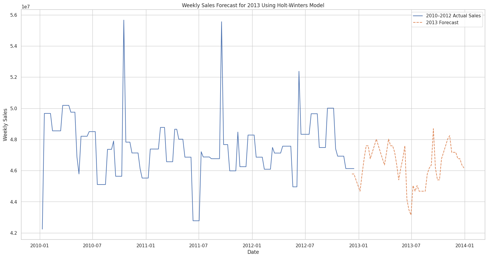
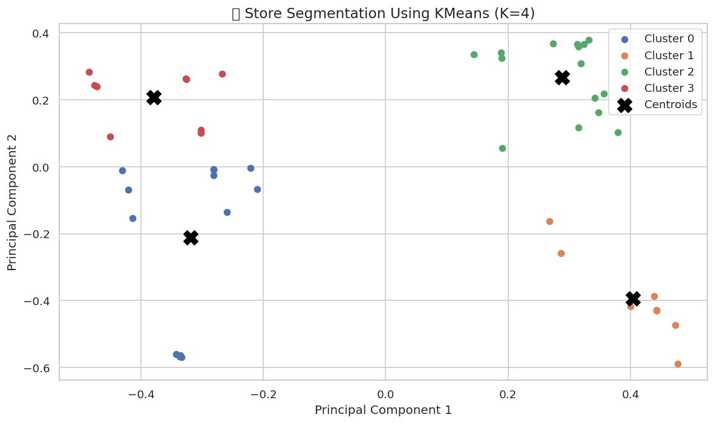
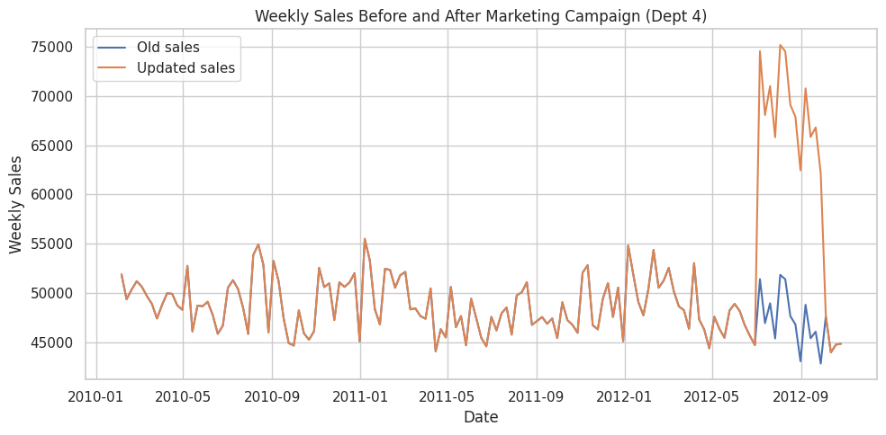
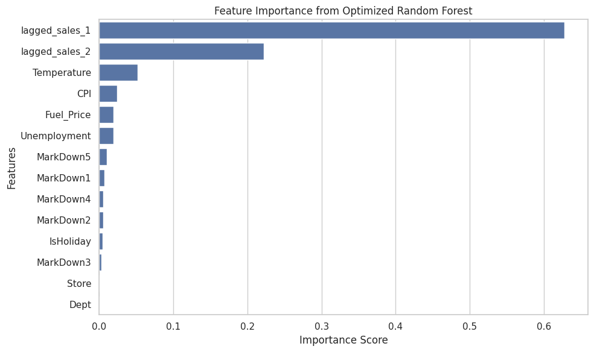

# 🛒 Retail Demand Forecasting & Sales Analytics

An end-to-end analytics pipeline on 3 years (2010–2012) of multi-store, multi-department retail sales data — combining exploratory analytics, anomaly detection, segmentation, market basket analysis, multi-model demand forecasting, and Bayesian causal inference into a single reproducible pipeline.

| | |
|---|---|
| **Project Type** | End-to-End Retail Analytics & Forecasting |
| **Domain** | Retail Analytics |
| **Dataset** | Walmart Recruiting – Store Sales Forecasting (Kaggle) |
| **Language** | Python |
| **Techniques** | Forecasting, Clustering, Market Basket Analysis, Causal Inference |

---

## 🧰 Tech Stack

`Python` · `pandas` · `NumPy` · `scikit-learn` · `statsmodels` · `mlxtend` · `tfcausalimpact` · `Matplotlib` · `Seaborn`


---

## 📖 Table of Contents

- [Why This Project?](#-why-this-project)
- [Key Features](#-key-features)
- [Architecture](#-architecture)
- [Dataset](#-dataset)
- [Project Structure](#-project-structure)
- [Results Summary](#-results-summary)
- [Methodology](#-methodology)
- [Skills Demonstrated](#-skills-demonstrated)
- [Business Impact](#-business-impact)
- [Strategic Recommendations](#-strategic-recommendations)
- [Future Improvements](#-future-improvements)
- [Known Challenges](#-known-challenges)
- [Setup](#-setup)
- [License](#-license)

---

## 🎯 Why This Project?

This project simulates a real-world retail analytics workflow by combining exploratory analytics, forecasting, segmentation, association rule mining, and causal inference into a single reproducible pipeline. Rather than focusing solely on predictive accuracy, it demonstrates how multiple analytical techniques can be integrated to support business decisions — from inventory planning to marketing ROI evaluation.

---

## ✨ Key Features

- End-to-end retail analytics pipeline, from raw CSVs to business recommendations
- Automated, checkpoint-based feature engineering across 9 modular notebooks
- Statistical (IQR) and time-series (rolling average) anomaly detection
- Store & department clustering using PCA + K-Means, with silhouette-score validation
- Market basket analysis using the Apriori algorithm on department-level co-occurrence
- Multi-model demand forecasting (SARIMA, Random Forest, Holt-Winters)
- Bayesian causal impact evaluation of a simulated marketing campaign
- Business recommendations for inventory, pricing, and store optimization

---

## 🏗️ Architecture

```
                Raw CSV Files
                     │
                     ▼
          Data Cleaning & Validation
                     │
                     ▼
        Feature Engineering Pipeline
                     │
                     ▼
       ┌─────────────┴──────────────┐
       ▼                            ▼
Anomaly Detection            Segmentation (PCA + K-Means)
       │                            │
       ▼                            ▼
Market Basket Analysis      Demand Forecasting
                             (SARIMA / RF / Holt-Winters)
       │                            │
       └─────────────┬──────────────┘
                     ▼
          Causal Impact Evaluation
                     │
                     ▼
        Business Recommendations
                     │
                     ▼
             Visual Reports
```

Each stage persists its outputs to a shared checkpoint folder, so any notebook can be run independently in a fresh kernel without relying on another notebook's variables still being in memory.

---

## 🗂️ Dataset

Historical weekly sales data for 45 stores (2010-02-05 to 2012-11-01), each containing multiple departments, along with store metadata and regional economic indicators.

| File | Contents |
|---|---|
| `stores.csv` | Store number, type, and size |
| `features.csv` | Store, Date, Temperature, Fuel_Price, MarkDown1–5, CPI, Unemployment, IsHoliday |
| `sales.csv` | Store, Dept, Date, Weekly_Sales, IsHoliday |

The four largest US holidays (Super Bowl, Labor Day, Thanksgiving, Christmas) fall within the sales window and are flagged via `IsHoliday`. `MarkDown1–5` (anonymized promotional markdown data) is only available from November 2011 onward and contains missing values by design.

> Dataset source: Walmart Recruiting – Store Sales Forecasting (Kaggle)

---

## 🔧 Project Structure

```
retail-demand-forecasting/
├── data/
│   ├── sales.csv
│   ├── stores.csv
│   ├── features.csv
│   └── checkpoints/              # intermediate pipeline outputs (generated on run)
├── notebooks/
│   ├── 01_data_ingestion_and_eda.ipynb
│   ├── 02_data_preprocessing_and_feature_engineering.ipynb
│   ├── 03_anomaly_detection.ipynb
│   ├── 04_time_series_anomaly_and_pca.ipynb
│   ├── 05_store_dept_segmentation.ipynb
│   ├── 06_market_basket_analysis.ipynb
│   ├── 07_demand_forecasting_sarima_rf.ipynb
│   ├── 08_forecasting_enhanced_and_holtwinters.ipynb
│   └── 09_external_factors_and_causal_impact.ipynb
├── images/
├── requirements.txt
└── README.md
```

**Reproducibility:** all notebooks are independently executable and use intermediate checkpoints to ensure reproducibility without relying on notebook execution order beyond the documented pipeline. Run order: `01 → 02 → 03 → 04 → 05 → 06` and separately `07 → 08 → 09`.

---

## 📊 Results Summary

| Metric | Result |
|---|---|
| Stores Analyzed | 45 |
| Departments | 81 |
| Weekly Sales Records | 421,570 |
| Store Clusters | 4 |
| Department Clusters | 4 |
| Association Rules Discovered | 7 (min support 1.1%, min confidence 80%, min lift 3) |
| Strongest Rule Lift | 77.5 |
| Forecast Horizon | 56 weeks (full year 2013) |
| Forecasting Models Compared | 3 (SARIMA, Random Forest, Holt-Winters) |
| Campaign Relative Lift (Causal Impact) | +29.9% [95% CI: 26.9%, 32.7%] |

### Forecasting Model Performance

| Model | MAE | RMSE | Scope |
|---|---|---|---|
| SARIMA (tuned via `auto_arima`) | 5,295 | 9,345 | Department-level weekly sales |
| Random Forest (baseline) | 1,693 | 2,935 | Department-level weekly sales |
| Random Forest (enhanced features) | 1,387 | 2,586 | Department-level weekly sales |
| Holt-Winters (tuned, damped trend + Box-Cox) | 2,140,547 | 3,155,771 | Total aggregated weekly sales (all stores/depts) |

> Note: Holt-Winters forecasts total company-wide weekly sales (hence the larger scale), while SARIMA and Random Forest forecast at department granularity — these aren't directly comparable model-vs-model, but each is the strongest performer within its own scope.

---

## 🔬 Methodology

### 1–2. Data Ingestion, EDA & Feature Engineering
Merged sales, store, and macroeconomic feature data into a unified analytical base; handled missing values (particularly `MarkDown1–5`); engineered time-based features (`Month`, `Week`, `Year`) and encoded store `Type`.

### 3–4. Anomaly Detection
IQR-based outlier detection on `Weekly_Sales`, plus time-based anomaly detection using rolling average and rolling standard deviation thresholds, segmented by holiday vs. non-holiday weeks.

### 5. Store & Department Segmentation
PCA → K-Means clustering, validated via silhouette score across `n_clusters = 2–9`. Stores were grouped into **4 clusters** (e.g., large-format high-CPI stores vs. compact value stores); departments were similarly grouped into **4 clusters** based on sales, markdown, and CPI behavior.

### 6. Market Basket Analysis
Apriori algorithm applied to department-level co-occurrence (individual transaction data isn't available, so department sales co-occurrence is used as a proxy). Surfaced **7 association rules** at the configured thresholds, with lift values up to **77.5** — indicating some department pairs co-occur far more than chance would predict.

### 7–8. Demand Forecasting
Three models compared: **SARIMA** (with CPI/fuel/temperature % change as external regressors, tuned via `auto_arima`), **Random Forest** (tuned via `GridSearchCV`, using lagged sales and markdown features), and **Holt-Winters** (seasonal + damped trend + Box-Cox, forecasting the full 2013 year).

### 9. External Factors & Causal Impact
Incorporated CPI, fuel price, and temperature % changes as forecasting features. Evaluated a simulated marketing campaign on a specific department using **CausalImpact** (Bayesian structural time-series): estimated a **+29.9% relative lift** in weekly sales (95% CI: 26.9%–32.7%) with a posterior probability of a genuine causal effect near 100%.

---

## 🧠 Skills Demonstrated

| Category | Skills |
|---|---|
| Data Analysis | pandas, NumPy |
| Machine Learning | Random Forest, K-Means |
| Time Series | SARIMA, Holt-Winters |
| Statistics | PCA, IQR, Rolling Statistics, Silhouette Analysis |
| Business Analytics | Market Basket Analysis (Apriori) |
| Causal Inference | Bayesian Structural Time Series |
| Visualization | Matplotlib, Seaborn |

---

## 💼 Business Impact

| Analysis | Business Value |
|---|---|
| Demand Forecasting | Reduce stock-outs and overstock through accurate weekly sales prediction |
| Store/Dept Clustering | Enable personalized inventory planning per store profile |
| Market Basket Analysis | Inform product placement and cross-selling strategy |
| Causal Impact | Quantify marketing ROI with statistical confidence |
| Anomaly Detection | Surface operational issues (e.g., markdown or supply irregularities) early |

---

## 🧠 Strategic Recommendations

**Inventory management:** use CPI and temperature trends to anticipate demand shifts and time stock replenishment around seasonal spikes.

**Pricing strategy:** align markdown timing with low-inflation / low-fuel-price periods identified in the feature analysis.

**Store optimization:** use department co-occurrence patterns from the market basket analysis to inform store layout and cross-merchandising, and tailor inventory to each store's cluster profile.

---

## 🚀 Future Improvements

- Integrate XGBoost and LightGBM forecasting models
- Deploy as a Streamlit dashboard
- Automate the pipeline using Airflow
- Containerize with Docker
- Build REST APIs using FastAPI
- Add MLflow experiment tracking
- Move reusable logic into a `src/` package, keeping notebooks focused on analysis/experimentation, with configuration files for paths/parameters and unit tests for core preprocessing functions

---

## ⚠️ Known Challenges

- Missing values and irregular frequency in markdown and macroeconomic data
- Holt-Winters convergence sensitivity on longer horizons
- Overfitting risk in Random Forest without careful hyperparameter tuning
- Weekly-frequency data required careful date alignment for the causal impact analysis

---

## 🛠️ Setup

```bash
git clone https://github.com/Arushikhare6/retail-demand-forecasting.git
cd retail-demand-forecasting
python -m venv venv
venv\Scripts\activate        # Windows
pip install -r requirements.txt
```

Place `sales.csv`, `stores.csv`, and `features.csv` in `data/`, then run the notebooks in `notebooks/` in numerical order.

---

## 🖼️ Visual Insights

| Visualization | Description |
|---|---|
|  | Forecasted 2013 sales using SARIMAX and Holt-Winters |
|  | Store segmentation via PCA + K-Means |
|  | Causal impact of the simulated marketing campaign on Dept 4 |
|  | Top features driving the Random Forest sales prediction |

---

## 📄 License

This project is licensed under the MIT License — see the [LICENSE](LICENSE) file for details.
